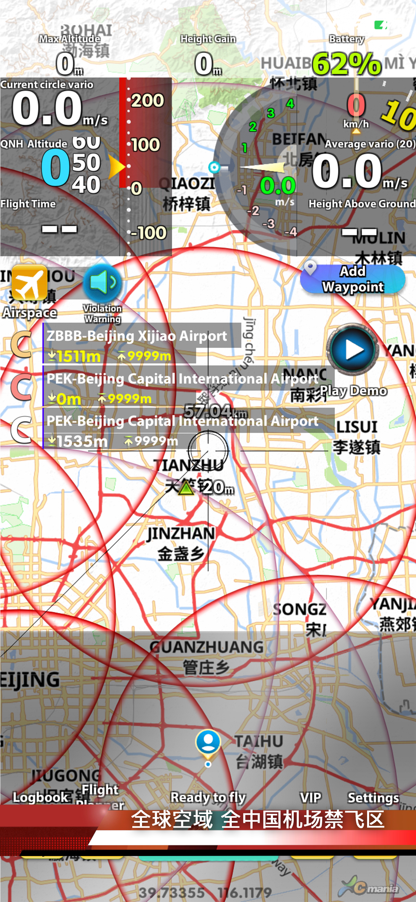

# XCMania中国市场版
 
## 中国完全自主知识产权

从中国翻译到中国创造，XCMania （野飞达人）是中国首个拥有完全自主知识产权的飞行电脑。目前是市面上为数不多的同时支持安卓与苹果手机的应用。

目前开源软件有许多选择，诸如XCSoar，LK8000，这些软件大多诞生于15年前，专门为滑翔机而设计。大多设计为使用线缆连接外部设备，用于滑翔伞有诸多不便。

伴随着苹果安卓的崛起， App飞行电脑 + 蓝牙高精度爬升表 是一个新进崛起的滑翔伞飞行解决方案，正受到越来越多的飞行员的欢迎。毕竟Oudie 3、4、5需要不停购买新硬件才能保持升级。而App是在不停的更新当中，并伴随着手机的换代在不停提升中。

7年前诞生XCT，FlySky等一批优秀作品。但是7年过去了，手机的运算能力已经有了几十倍的飞跃。这些软件大多停留在了那个时代。在这些软件中GPU（图形处理器）基本都在吃灰。

## 新人免费

在试用版状态下，您可以使用完整功能。唯一的限制：试用版仅记录20分钟内的飞行。这一时间足够滑翔伞新人记录自己的起落数量与日常飞行的点点滴滴。

## 手机需求

- [x] 需要Android  2017年后上市的手机
- [x] 最好配合有气压传感器的手机 / 或者连接蓝牙高度表使用 -- 诸如中国的“蜻蜓”或瑞士的XCtracer等等。

如果您的手机未配有气压计，XCMania会使用GPS高度飞行，但是GPS精度并不适合搜寻气流。

XCMania在飞行中计算量与3D渲染比9年前的那些软件高一个量级，需要更强的手机。

## 下载地址

[百度盘链接](https://pan.baidu.com/s/1cQOfzMmk9pOFzW9QYxATTA)

链接: https://pan.baidu.com/s/1cQOfzMmk9pOFzW9QYxATTA 提取码: htmu 复制这段内容后打开百度网盘手机App，操作更方便哦

百度盘下载

下载后请根据提示前往微店购买年卡即可激活应用。

## 应用截屏

## 其他

如需最新情报，可在抖音关注 “XCMania”

# 苹果手机用户 

[前往苹果应用商店](https://apps.apple.com/cn/app/%E9%87%8E%E9%A3%9E%E8%BE%BE%E4%BA%BA/id1494610953?itsct=apps_box&itscg=30200)

扫码二维码前往苹果店

也可在苹果店中搜索XCMania或“野飞达人”。

### 冷知识

你知道吗？Oudie 5的CPU是一个单核800兆主频，只有128M内存的设备么?

主流手机大多拥有八核运行于2000兆主频的CPU，并拥有一颗至少八核GPU（图形处理器），内存大多在4096M（4G）之上。
