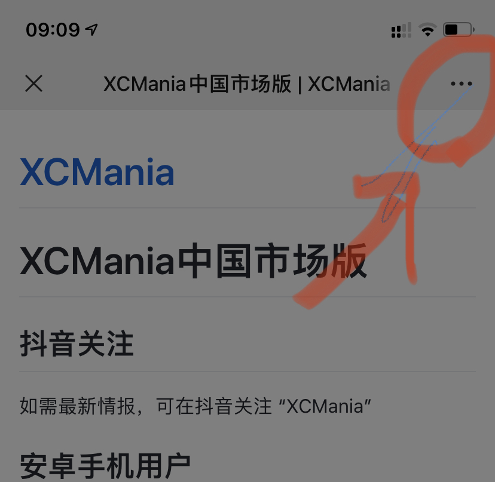
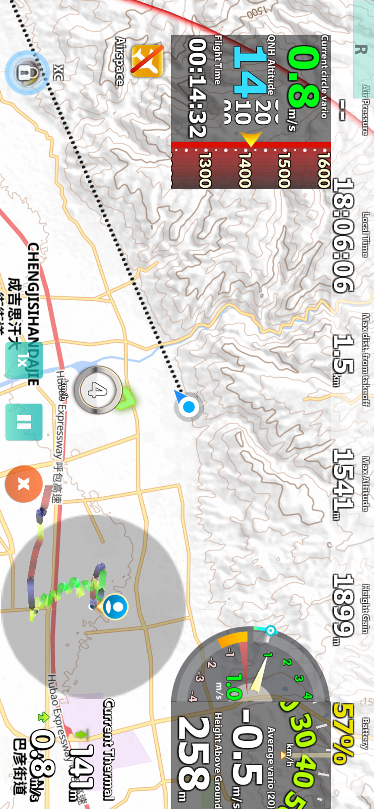
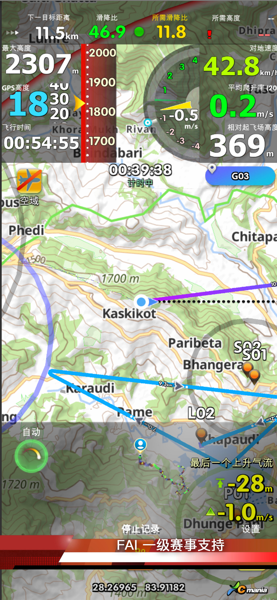

# XCMania中国市场版

## 抖音关注

如需最新情报，可在抖音关注 “XCMania”

## 更新

更新 1.7:

- 更好的3D气流成像。
- 飞行轨迹3D展示分析。
- 在弱GPS信号下获取正确的修正海压。

更新 1.6 ：

- 增加1000GB的全球高精度高程图。是的，数据总量超过1TB。
- 改善地图缩放体验。

## 中国安卓手机用户

需要使用手机浏览器打开本页面，然后下载，其他应用（如微信）都可能无法打开安装包下载链接。

[浏览器下载 XCMania 中国版APK](https://xcm1.s3-ap-southeast-1.amazonaws.com/china/xcm-china.1.7.apk)

安卓手机用户下载后请先测试使用。免费版单次飞行限制记录20分钟，不限制飞行次数，试用多久都可以。

如测试结果满意，可根据提示前往微店购买年卡即可激活应用。年卡激活后绑定手机，不会因删除应用而丢失。

## 微信传输apk安装包后，无法安装
微信会将文件名会被修改导致无法安装。
[百度知道 如何安装微信下载的安装包](https://zhidao.baidu.com/question/305162431448848164.html)

## 苹果手机用户 

[前往苹果应用商店](https://apps.apple.com/cn/app/%E9%87%8E%E9%A3%9E%E8%BE%BE%E4%BA%BA/id1494610953?itsct=apps_box&itscg=30200)

扫码二维码前往苹果店

也可在苹果店中搜索“XCMania”或“野飞达人”。

## Google Android用户

前往谷歌商店搜索 “XCMania”。

## 新人免费

在试用版状态下，您可以使用完整功能。唯一的限制：试用版仅记录20分钟内的飞行。这一时间足够滑翔伞新人记录自己的起落数量与日常飞行的点点滴滴。

## 手机需求

- [x] 需要iPhone 7（或更高） 或者 Android  10.0（或更高）的手机
- [x] 配合有气压传感器的手机可以独立运行无需其他硬件 （iPhone 全系列都配备，安卓只有5%的手机型号配备）
- [x] 无气压计的手机可配合蓝牙高度DiDi使用 - DIY蓝牙DiDi只需¥50，便宜的(数百人民币)诸如中国的“蜻蜓”，或配合世界顶尖水平的瑞士XCtracer(价格¥3600左右)等等。

如果您的手机未配有气压计，XCMania会使用GPS高度飞行，但是GPS精度并不适合搜寻气流。

## 中国完全自主知识产权

从中国翻译到中国创造，XCMania （野飞达人）是中国首个跨平台拥有完全自主知识产权的飞行电脑。目前是市面上为数不多的同时支持安卓与苹果手机的应用。

目前开源软件有许多选择，诸如XCSoar，LK8000，这些软件大多诞生于15年前，专门为滑翔机而设计。大多为滑翔机镶嵌屏幕设计，并使用线缆连接外部设备。

伴随着苹果与安卓的崛起， App飞行电脑 + 蓝牙高精度爬升表是一个新进崛起的滑翔伞飞行解决方案，正受到越来越多的飞行员的欢迎。
塑料盒子+液晶屏的“飞行电脑”需要不停购买新硬件才能保持升级。而XCMania是在不停的更新当中，并伴随着手机的换代在不停提升中。

## 应用截屏

